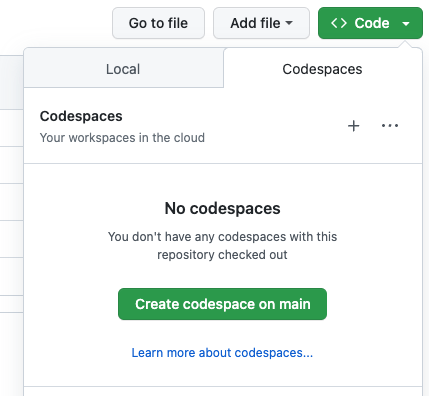
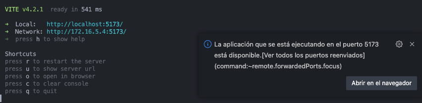

# Paella 7 tutorials

- [Part 1](doc/tutorial-part-1.md): Building the simplest player 
- [Part 2](doc/tutorial-part-2.md): Adding plugins
- [Part 3](doc/tutorial-part-3.md): Change how paella obtains the `videoid`, the `video manifest` and the `configuration`.
- [Part 4](doc/tutorial-part-4.md): Styling.
- [Part 5](doc/tutorial-part-5.md): Use the paella API to control the player.
- [Part 6](doc/tutorial-part-6.md): Create a custom paella plugin package.


# How to run the tutorials in github codespaces

First, click on green button "Code" and create a codespace



Once codespace created, wait until all is installed and in the terminal window go to the tutorial folder and install the dependencies

```sh
cd packages/paella7-demo-part1
npm install
```

Then run de demo in development mode

```sh
npm run dev -- --host
```

Development server will run. Click the button or press `o` key to open the browser.
