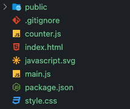
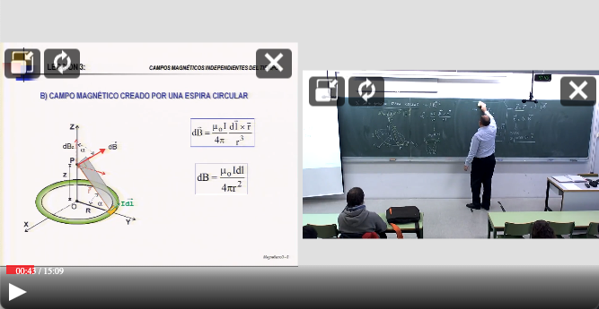

# Integrate Paella 7 in your website (Part 1)

In this tutorial we are going to view how to integrate Paella 7 in your website

1. Paella 7 introduction
2. Considerations
3. Paella 7 initialization


## Paella 7 introduction

Starting with version 7, Paella Player is divided into several packages:

- `paella-core`: is the base library from which we can create our own custom player.
- `paella-*-plugin`: a series of packages that include different plugins to extend Paella.
    * `paella-basic-plugins`: most commonly used plugins (volume, subtitle selection, video layout change, playback speed, etc.).
    * `paella-slide-plugins`: plugins designed to interact with slide-based presentations.
    * `paella-zoom-plugin`: allows you to zoom into the video.
    * `paella-user-tracking`: integration with usage analysis tools.
    * `paella-layout-plugins`: Extra video layout plugins.

- [`paella-player`](https://github.com/polimediaupv/paella-player): is the Paella reference player, which integrates `paella-core` with other plugins. Unlike the other packages, `paella-player` is not a library. 

In this tutorial, you are going to create your own Paella Player configuration from scratch. You will set up an installation with the dependencies you need, which will usually be `paella-core` and some plugins. 

For Mac users, you need to have Xcode and the development tools for the command terminal installed. You can download Xcode from the Mac App Store, and then install the development tools in the terminal using this command:

```sh
xcode-select --install
```

## Considerations

Paella needs 3 things to be able to play videos:

1. The paella configuration
    
    Paella loads the configuration trying to load a `config/config.json` file by default.

2. Thi video identifier

    Paella needs a video identifier. Paella or some plugins use this ID to load the video manifest or to load/save some properties.

    By default, paella loads the video identifier using the HTTP query parameter `id`. Example: `http://my.web.page/?id=<videoid>`


3. A video manifest

    The [video manifest](https://paellaplayer.upv.es/#/doc/video_manifest.md) is a json document that catalogs the properties and resources that make up a multi stream video for Paella Player.
    
    By default, the manifest is stored in a file named `<config.repository>/<videoID>/data.json`
    
All these properties can be changed during the paella 7 initialization to adjust to your needs.    
To learn more about how to modify this configuration, see the [initialization documentation](https://paellaplayer.upv.es/#/doc/initialization.md).


In this tutorial we will assume the paella defaults:

- `config.json` file will be loaded from `config/condig.json`.
- `video id` will be obtained from `id` query parameter.
- `video manifest` will be loaded from `<config.repository>/<videoID>/data.json`

But in second part we will view how to change thoses parameters.


## Starting our project

In this tutorial we will use [vite](https://vitejs.dev/) to build the project.

Vite is a build tool that aims to provide a faster and leaner development experience for modern web projects.

To start our project we simple run this command:

```sh
$ npm create vite paella7-demo-part1 -- --template vanilla
```

`Vite` will ask for the framework to use. In this tutorial we will use `Vanilla Javascript`.

 ```
Scaffolding project in paella7-demo-part1...

Done. Now run:

  cd paella7-demo-part1
  npm install
  npm run dev
 ```

This will create a `paella7-demo-part1` with a basic template.




### Preparing the dependencies

Now we can go to `paella7-demo-part1` and install the `paella-core` dependency.

```sh
cd paella7-demo-part1
npm install paella-core
```

### Preparing the video repository

We are going to prepare a video with id `video-test`. As we described imn considerations, the manifest file will be fetched from `/repository/video-test/data.json`.

- `public/repository/video-test/data.json`

    ```json
    {
        "metadata": {
            "duration": 909.13,
            "title": "Belmar 15 minutes (multiresolution)",
            "preview": "https://repository.paellaplayer.upv.es/belmar-multiresolution/preview/belmar-preview.jpg"
        },
        "streams": [
            {
                "sources": {
                    "mp4": [
                        {
                            "src": "https://repository.paellaplayer.upv.es/belmar-multiresolution/media/720-presentation.mp4",
                            "mimetype": "video/mp4",
                            "res": {
                                "w": "1442",
                                "h": "1080"
                            }
                        }
                    ]
                },
                "preview": "https://repository.paellaplayer.upv.es/belmar-multiresolution/preview/presentation_cut.jpg",
                "content":"presentation"
            },
            {
                "sources": {
                    "mp4": [
                        {
                            "src": "https://repository.paellaplayer.upv.es/belmar-multiresolution/media/720-presenter.mp4",
                            "mimetype": "video/mp4",
                            "res": {
                                "w": "1920",
                                "h": "1080"
                            }
                        }
                    ]
                },
                "preview": "https://repository.paellaplayer.upv.es/belmar-multiresolution/preview/presenter_cut.jpg",
                "content":"presenter"
            }
        ],
        "frameList": [
            {
                "id": "frame_854",
                "mimetype": "image/jpeg",
                "time": 854,
                "url": "https://repository.paellaplayer.upv.es/belmar-multiresolution/slides/3d90109c-9608-44c1-8660-fce3f216d716/presentation_cut.jpg",
                "thumb": "https://repository.paellaplayer.upv.es/belmar-multiresolution/slides/403de1df-aa66-44c0-b600-7683acf249b8/presentation_cut.jpg"
            },
            {
                "id": "frame_751",
                "mimetype": "image/jpeg",
                "time": 751,
                "url": "https://repository.paellaplayer.upv.es/belmar-multiresolution/slides/598bd2ba-4fef-4886-884e-0ab82176f13d/presentation_cut.jpg",
                "thumb": "https://repository.paellaplayer.upv.es/belmar-multiresolution/slides/73a6564c-b2d6-4896-b0f1-38129dde2c85/presentation_cut.jpg"
            },
            {
                "id": "frame_0",
                "mimetype": "image/jpeg",
                "time": 0,
                "url": "https://repository.paellaplayer.upv.es/belmar-multiresolution/slides/7dc22bee-14f3-442c-8f0d-30d8b68c8604/presentation_cut.jpg",
                "thumb": "https://repository.paellaplayer.upv.es/belmar-multiresolution/slides/46561b90-85b3-4ad7-a986-cdd9b52ae02b/presentation_cut.jpg"
            },
            {
                "id": "frame_363",
                "mimetype": "image/jpeg",
                "time": 363,
                "url": "https://repository.paellaplayer.upv.es/belmar-multiresolution/slides/d3194d9b-8f65-403b-a639-9de4311a283b/presentation_cut.jpg",
                "thumb": "https://repository.paellaplayer.upv.es/belmar-multiresolution/slides/4505b6d9-8a0c-4809-ade3-840e743188ed/presentation_cut.jpg"
            }
        ]
    }
    ```

### Create the default Paella Player config file

- `public/config/config.json`

    ```json
    {
        "repositoryUrl": "/repository",
        "manifestFileName": "data.json",

        "defaultLayout": "presenter-presentation",
        "defaultAudioStream": "presenter",

        "plugins": {
            "es.upv.paella.mp4VideoFormat": {
                "enabled": true,
                "order": 1
            },
            "es.upv.paella.videoCanvas": {
                "enabled": true,
                "order": 1
            },            
            "es.upv.paella.singleVideo": {
                "enabled": true,
                "dualVideoContentIds": ["presenter-presentation"],
                "validContent": [
                    { "id": "presenter", "content": ["presenter"], "icon": "present-mode-2.svg", "title": "Presenter" },
                    { "id": "presentation", "content": ["presentation"], "icon": "present-mode-1.svg", "title": "Presentation" }
                ]
            },
            "es.upv.paella.dualVideoDynamic": {
                "enabled": true,
                "validContent": [
                    { "id": "presenter-presentation", "content": ["presentation","presenter"], "icon": "present-mode-3.svg", "title": "Presenter and presentation" }
                ]
            },
            "es.upv.paella.playPauseButton": {
                "enabled": true,
                "order": 1
            }
        }
    }
    ```

### Create the Paella Player files

- `index.html`

    ```html
    <!DOCTYPE html>
    <html lang="en">
        <head>
            <meta charset="UTF-8">
            <meta http-equiv="X-UA-Compatible" content="IE=edge">
            <meta name="viewport" content="width=device-width, initial-scale=1.0">
            <title>Paella 7 demo</title>
        </head>
        <body>
            <div id="player-container"></div>
            <script type="module" src="/main.js"></script>
        </body>
    </html>
    ```

- `style.css`
    ```css    
    body {
        margin: 0px;
    }

    #player-container {
        width: 100vw;
        height: 100vh;
        left: 0px;
        top: 0px;
        position: relative;
    }
    ```

- `main.js`

    ```javascript
    import './style.css'
    import { Paella } from 'paella-core';

    const paella = new Paella('player-container');
    paella.loadManifest()
        .then(() => console.log("done"))
        .catch(e => console.error(e));
    ```


### Test the player

We are done. We have the simplest player installation done!

To test your new player, run the following command:

```sh
$ npm run dev

VITE v4.1.4  ready in 256 ms

  ➜  Local:   http://localhost:5173/
  ➜  Network: use --host to expose
  ➜  press h to show help
```
Now we can open the following URL in a browser: `http://localhost:5173/?id=video-test`.




## Next

continue with [part 2](tutorial-part-2.md)