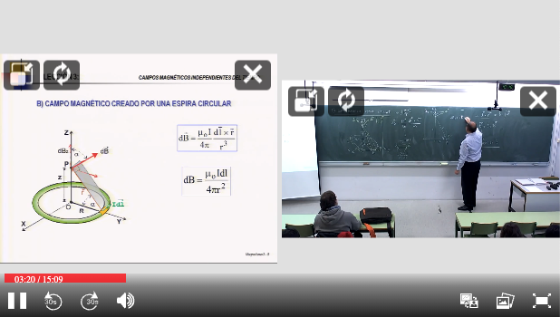

# Integrate Paella 7 in your website (Part 3)

In this part, we are going to see how to modify how paella gets the `videoid`, the `video manifest` and the `configuration`.

All these settings can be controled in the [initialization](https://paellaplayer.upv.es/#/doc/initialization.md) parameters.

```js
const initParams = {
    // Initialiation attributes
    configResourcesUrl: 'config/',    // Location of resources to be configured in the config.json file
    configUrl: 'config/config.json',    // Used by the default loadConfig function
    repositoryUrl: 'repository',    // URL to locate the video manifests (see getManifestUrl)
    manifestFileName: 'data.json',     // manifest file name (can be overrided in config.json)

    // Initialization callbacks
    loadConfig: default_load_config_function,      // overrides the config.json file load
    getVideoId: default_video_id_function,     // get the video identifier
    getManifestUrl: default_manifest_url_function,    // get the video manifest url
    getManifestFileUrl: default_manifest_file_url_function,   // get the full manifest file url
    loadVideoManifest: default_load_video_manifest_function,   // get the manifest file content

    customPluginContext: [],    // an array of require.context() function call results
    ...
}
```

We are going to create a new Paella initialization function than we can reuse that accepts 4 parameters:

1. The HTML element identifier
2. The video identifier
3. The configuration
4. The video manifest

```js

const paella = createPaellaPlayer(htmlElement, videoid, config, manifest);

```

Add a `createPaellaPlayer.js` file to add this funcionality.

## Change how to get the `video identifier`.

We need to add the `getVideoId` parameter to the paella initialization parameters, that is a function with the signature `async fucntion (config, player)`

This function should return the `videoid` parameter received by `createPaellaPlayer` function:

We modify our `createPaellaPlayer.js` file to add this funcionality:

```js
import getBasicPluginsContext from 'paella-basic-plugins';
import getSlidePluginsContext from 'paella-slide-plugins';

export function createPaellaPlayer(htmlElement, videoid, config, manifest) {

    async function getCustomVideoId(config, player) {    
        player.log.info("Using custom getVideoId function.");
        return videoid;
    }

    const initParams = {
        customPluginContext: [
            getBasicPluginsContext(),
            getSlidePluginsContext()
        ],
        getVideoId: getCustomVideoId
    };

    const paella = new Paella('player-container', initParams);
    return paella;
}
```

## Change how to get the `configuration`.

To change how paella loads the configuration, we can use two properties:

- `configUrl`: By default its equal to `config/config.json`, you can change it and paella will fetch that URL to load the configuration file.
- or `loadConfig`: It is a function with signature `async function (configUrl, player)`. By default paella fetches the file and parses it as a JSON file.

In this tutorial we are going to ignore the configUrl parameter and return a preloaded json.

```js
export function createPaellaPlayer(htmlElement, videoid, config, manifest) {
    ...
    async function loadCustomConfig(configUrl, player) {
        player.log.info("Using custom loadConfig function.");
        return config;
    }

    const initParams = {
        ...
        loadConfig: loadCustomConfig
    };
    ...
}
```

## Change how to get the `video manifest`.

To change how paella loads the video manifest, we can use three properties:

- `getManifestUrl`: It is a function with signature `async function (repoUrl, videoId, config, player)`
- `getManifestFileUrl`: It is a function with signature `async function (manifestUrl, manifestFileName, config, player)`
- `loadVideoManifest`: It is a function with signature `async function (videoManifestUrl, config, player)`

Supose our system has an API rest end point rest that returns the video data, but not in the format paella needs it. 
We can implement a `loadVideoManifest` function to fetch the video information and convert to a `video manifest` paella needs to play the video

Example:

```js
async function customLoadVideoManifestFunction(videoManifestUrl, config, player) {
    player.log.debug("Using cistom loadVideoManifest function");
    const response = await fetch(...);
    const responseJson = await response.json();

    const manifest = await convertToPaellaManifest(response.json);
    return manifest;
}
```

In this example we are going to reimplement the `loadVideoManifest` function, but retuning the video manifest passed to the `createPaellaPlayer` function.

```js
export function createPaellaPlayer(htmlElement, videoid, config, manifest) {
    ...
    async function customLoadVideoManifestFunction(videoManifestUrl,config,player) {
        player.log.debug("Using custom loadVideoManifest function");
        const response = await fetch(videoManifestUrl);
        return response.json();
    }

    const initParams = {
        ...
        loadVideoManifest: customLoadVideoManifestFunction
    };
    ...
}
```

## Put all together

- `createPaellaPlayer.js` file:

    ```js
    import { Paella } from 'paella-core';
    import getBasicPluginsContext from 'paella-basic-plugins';
    import getSlidePluginsContext from 'paella-slide-plugins';

    export function createPaellaPlayer(htmlElement, videoid, config, manifest) {

        async function getCustomVideoId(config, player) {
            player.log.info("Using custom getVideoId function.");
            return videoid;
        }

        async function loadCustomConfig(configUrl, player) {
            player.log.info("Using custom loadConfig function.");
            return config;
        }
        
        async function customLoadVideoManifestFunction(videoManifestUrl, config, player) {
            player.log.info("Using custom loadVideoManifest function");
            return manifest;
        }

        const initParams = {      
            customPluginContext: [
                getBasicPluginsContext(),
                getSlidePluginsContext()
            ],  
            getVideoId: getCustomVideoId,
            loadConfig: loadCustomConfig,
            loadVideoManifest: customLoadVideoManifestFunction
        };

        const paella = new Paella(htmlElement, initParams);
        return paella;
    }
    ```

- `main.js` file:

    ```js
    import './style.css'
    import { createPaellaPlayer } from './createPaellaPlayer';
    import config from './src/config.json?raw'
    import manifest from './src/repository/video-test/data.json?raw';

    const paella = createPaellaPlayer('player-container', 'videoid', JSON.parse(config), JSON.parse(manifest))

    paella.loadManifest()
        .then(() => console.log("done"))
        .catch(e => console.error(e));
    ```

## Test the changes

We are done. To test the chnages, run the following command:

```sh
$ npm run dev

VITE v4.1.4  ready in 256 ms

  ➜  Local:   http://localhost:5173/
  ➜  Network: use --host to expose
  ➜  press h to show help
```
Now we can open the following URL in a browser: `http://localhost:5173/?videoid=video-test`.

