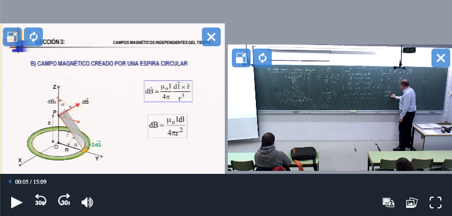

# Integrate Paella 7 in your website (Part 4)

Now we are going to style Paella to fit our needs. 

- Change the `Backward`, `Forward` and `Fullscreen` buttons.
- Add a custom CSS theme to customize the player.

## Change the icons of the buttons

Each plugin can define a set of icons the plugin uses and can be changed. In de documentation of each plugin is described the set of icons used by the plugin. 

For instance, the `fullscreen button plugin` define two icons:

- `fullscreenIcon`: enter fullscreen mode icon.
- `windowedIcon`: exit fullscreen mode icon.

To change a icon you need to call to `paella.addCustomPluginIcon(pluginName, iconName, svgData)` function. Example:

```js
import FullscreenIcon from "./icons/fullscreen-icon.svg?raw"

await paella.addCustomPluginIcon("es.upv.paella.fullscreenButton",
    "fullscreenIcon",
    FullscreenIcon);
```

So, we need to modify the `createPaellaPlayer.js` file and add this:

```diff
+ // import the icons
+ import BackwardIcon from "./icons/backward-icon.svg?raw";
+ import ForwardIcon from "./icons/forward-icon.svg?raw";
+ import FullscreenIcon from "./icons/fullscreen-icon.svg?raw";

const paella = new Paella('player-container', initParams);

+ // change the icons
+ await paella.addCustomPluginIcon("es.upv.paella.fullscreenButton",
+   "fullscreenIcon", FullscreenIcon);
+ await paella.addCustomPluginIcon("es.upv.paella.backwardButtonPlugin",
+   "backwardIcon", BackwardIcon);
+ await paella.addCustomPluginIcon("es.upv.paella.forwardButtonPlugin",
+   "forwardIcon", ForwardIcon);

  paella.loadManifest()
    .then(() => console.log("done"))
    .catch(e => console.error(e));

```

and of course we need to add the SVG icons to the source folder:

- `icons/backward-icon.svg`:

```svg
<svg width="19" height="21" viewBox="0 0 19 21" xmlns="http://www.w3.org/2000/svg">
    <style>
        .time-text {
            font: 10px sans-serif;
            text-align: right;
            font-weight: bolder;
        }
    </style>
    <path d="M5.55144 0.849227C5.17205 0.429901 4.50568 0.381339 4.06305 0.740762L0.368609 3.74076C0.13465 3.93074 0 4.20809 0 4.50002C0 4.79194 0.13465 5.06929 0.368609 5.25927L4.06305 8.25927C4.50568 8.6187 5.17205 8.57014 5.55144 8.15081C5.93083 7.73148 5.87957 7.10018 5.43695 6.74076L3.90899 5.50002H9.76389C13.6989 5.50002 16.8889 8.5221 16.8889 12.25C16.8889 14.7284 15.479 16.8948 13.3776 18.0686C12.8852 18.3437 12.6177 18.9029 12.8164 19.4106C13.0236 19.94 13.6546 20.2082 14.1779 19.938C17.0507 18.4545 19 15.5679 19 12.25C19 7.41753 14.8649 3.50002 9.76389 3.50002H3.90899L5.43695 2.25927C5.87957 1.89985 5.93083 1.26855 5.55144 0.849227Z" />
    <text class="time-text" x="0" y="19">30</text>
</svg>

```

- `icons/forward-icon.svg`:

```svg
<?xml version="1.0" encoding="UTF-8" standalone="no"?>
<!DOCTYPE svg PUBLIC "-//W3C//DTD SVG 1.1//EN" "http://www.w3.org/Graphics/SVG/1.1/DTD/svg11.dtd">
<svg width="100%" height="100%" viewBox="0 0 19 21" version="1.1" xmlns="http://www.w3.org/2000/svg" xmlns:xlink="http://www.w3.org/1999/xlink" xml:space="preserve" xmlns:serif="http://www.serif.com/" style="fill-rule:evenodd;clip-rule:evenodd;stroke-linejoin:round;stroke-miterlimit:2;">
    <style>
        .time-text {
            font: 10px sans-serif;
            text-align: right;
            font-weight: bolder;
        }
    </style>
    <path d="M13.449,0.849C13.828,0.43 14.494,0.381 14.937,0.741L18.631,3.741C18.865,3.931 19,4.208 19,4.5C19,4.792 18.865,5.069 18.631,5.259L14.937,8.259C14.494,8.619 13.828,8.57 13.449,8.151C13.069,7.731 13.12,7.1 13.563,6.741L15.091,5.5L9.236,5.5C5.301,5.5 2.111,8.522 2.111,12.25C2.111,14.728 3.521,16.895 5.622,18.069C6.115,18.344 6.382,18.903 6.184,19.411C5.976,19.94 5.345,20.208 4.822,19.938C1.949,18.455 0,15.568 0,12.25C0,7.418 4.135,3.5 9.236,3.5L15.091,3.5L13.563,2.259C13.12,1.9 13.069,1.269 13.449,0.849Z" style="fill-rule:nonzero;"/>
    <text class="time-text" x="5" y="19">30</text>
</svg>
```

- `icons/fullscreen-icon.svg`:

```svg
<svg width="20" height="20" viewBox="0 0 20 20" xmlns="http://www.w3.org/2000/svg">
<path fill-rule="evenodd" clip-rule="evenodd" d="M0.87868 0.87868C1.44129 0.31607 2.20435 0 3 0H6C6.55228 0 7 0.447715 7 1C7 1.55228 6.55228 2 6 2H3C2.73478 2 2.48043 2.10536 2.29289 2.29289C2.10536 2.48043 2 2.73478 2 3V6C2 6.55228 1.55228 7 1 7C0.447715 7 0 6.55228 0 6V3C0 2.20435 0.31607 1.44129 0.87868 0.87868ZM13 1C13 0.447715 13.4477 0 14 0H17C17.7957 0 18.5587 0.31607 19.1213 0.87868C19.6839 1.44129 20 2.20435 20 3V6C20 6.55228 19.5523 7 19 7C18.4477 7 18 6.55228 18 6V3C18 2.73478 17.8946 2.48043 17.7071 2.29289C17.5196 2.10536 17.2652 2 17 2H14C13.4477 2 13 1.55228 13 1ZM1 13C1.55228 13 2 13.4477 2 14V17C2 17.2652 2.10536 17.5196 2.29289 17.7071C2.48043 17.8946 2.73478 18 3 18H6C6.55228 18 7 18.4477 7 19C7 19.5523 6.55228 20 6 20H3C2.20435 20 1.44129 19.6839 0.87868 19.1213C0.31607 18.5587 0 17.7957 0 17V14C0 13.4477 0.447715 13 1 13ZM19 13C19.5523 13 20 13.4477 20 14V17C20 17.7957 19.6839 18.5587 19.1213 19.1213C18.5587 19.6839 17.7957 20 17 20H14C13.4477 20 13 19.5523 13 19C13 18.4477 13.4477 18 14 18H17C17.2652 18 17.5196 17.8946 17.7071 17.7071C17.8946 17.5196 18 17.2652 18 17V14C18 13.4477 18.4477 13 19 13Z" />
</svg>
```

## Add a custom CSS theme

To add a custom css theme, `paella` provides in the utility package that allows us to load stylesheets dynamically, and so we make sure that these new styles overwrite the existing ones.

So, we need to add to the `style.css` file your custom CSS theme. For example:

```css
:root {
    --main-bg-color: #1F2937;
    --main-bg-color-hover: #1F2937;
    --main-bg-gradient: #1F2937;
    --secondary-bg-color-hover: #1F2937;

    --highlight-bg-color: #3073B8;
    --highlight-bg-color-hover: #3a8bdd;

    --base-video-rect-background-color: #9CA3AF;
}

.player-container button:focus-visible {
    outline-color: #DD3A8B
}

.playback-bar {
    -webkit-user-select: none;
    user-select: none;
}

.progress-indicator-container {
	forced-color-adjust: none;
}

.playback-bar .button-plugins .button-plugin-container div.non-interactive {
    margin-top: -2px;
}

.video-container {
    background-color: #9CA3AF;
}

.progress-indicator {
    height: 25px;
    width: calc(100% - 30px);
    margin-left: 15px;
}

.progress-indicator .progress-indicator-content {
    border-top-left-radius: 20px;
    border-bottom-left-radius: 20px;
    height: 6px;
}

.progress-indicator .progress-indicator-remaining {
    border-radius: 20px;
    height: 6px;
    background-color: #D1D5DB;
}

.progress-indicator .progress-indicator-handler {
    background-color: white;
    width: 16px;
    height: 16px;
}

.video-canvas .button-area button {
    background-color: var(--highlight-bg-color);
    width: 32px;
    height: 32px;
    box-sizing: border-box;
    padding: 6px;
}

.video-canvas .button-area button {
    background-color: var(--highlight-bg-color-hover);
}

.video-canvas .button-area button svg path {
    fill: #F9FAFB;
}

.playback-bar .button-plugins button i svg {
    fill: #F9FAFB;
}

.playback-bar .button-plugins .button-plugin-container button {
    border-radius: 7px;
}

.playback-bar .button-plugins {
    height: calc(var(--button-fixed-height) - 1px);
    padding: 4px;
}

.playback-bar .button-plugins.left-side {
    margin-left: 5px;
}

.playback-bar .button-plugins.right-side {
    margin-right: 5px;
}
```

It's important the CSS theme import is done after all paella imports to override the CSS properties.

```js
// Import first all paella packages
import { Paella } from 'paella-core';
import getBasicPluginsContext from 'paella-basic-plugins';
import getSlidePluginsContext from 'paella-slide-plugins';

// Finally, import the CSS theme to override the CSS properties
import './style.css';
```

### More customizations

More info in the Paella documentation:

- [Customization](https://paellaplayer.upv.es/#/doc/customization.md).
- [Progress indicator customization](https://paellaplayer.upv.es/#/doc/progress_indicator_customization.md)
- [Paella styles](https://paellaplayer.upv.es/#/doc/styles.md)


## Test the changes

We are done. To test the chnages, run the following command:

```sh
$ npm run dev

VITE v4.1.4  ready in 256 ms

  ➜  Local:   http://localhost:5173/
  ➜  Network: use --host to expose
  ➜  press h to show help
```
Now we can open the following URL in a browser: `http://localhost:5173/?videoid=video-test`.

