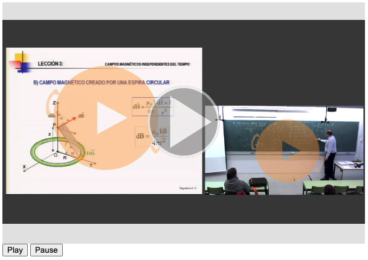

# Integrate Paella 7 in your website (Part 5)

In this part, we are going to control paella player from another part of the web page.

As en example, we are goin to add two HTML buttons to the webpage to play/pause the video.

## Add the buttons

To add the buttons to out page we can simply add it to our `index.html` file: 

```diff
  <body>
      <div id="player-container"></div>
+     <button id="playButton" type="button">Play</button>
+     <button id="pauseButton" type="button">Pause</button>
      <script type="module" src="/main.js"></script>
  </body>
```

and change de `style.css` file:

```diff
  #player-container {
-     width: 100vw;
-     height: 100vh;    
+     width: 600px;
+     height: 400px;
      position: relative;
  }
```

# Add the funcionality to our buttons

To control the player or the get information about timeline we can use the `paella` instance we created.

Please refer tho the [paella object documentation](https://paellaplayer.upv.es/#/doc/paella_object.md) to get a list of all API calls.

We are going to use the playback functions:

- `async play()`: starts or resumes video playback. If the player is in the MANIFEST_LOADED state, it ends loading automatically before starting playback.
- `async pause()` pauses the video, if the player is fully loaded.
- `async paused()`: returns true if the video is paused or not loaded, or false is the video is playing.
- `async stop()`: stops the video, if the player is fully loaded.

In our `main.js` file we need to add this funcionality to the buttons:

```js
document.querySelector('#playButton').addEventListener('click', () => { paella.play(); });
document.querySelector('#pauseButton').addEventListener('click', () => { paella.pause(); });
```

## Test the changes

We are done. To test the chnages, run the following command:

```sh
$ npm run dev

VITE v4.1.4  ready in 256 ms

  ➜  Local:   http://localhost:5173/
  ➜  Network: use --host to expose
  ➜  press h to show help
```
Now we can open the following URL in a browser: `http://localhost:5173/?videoid=video-test`.

